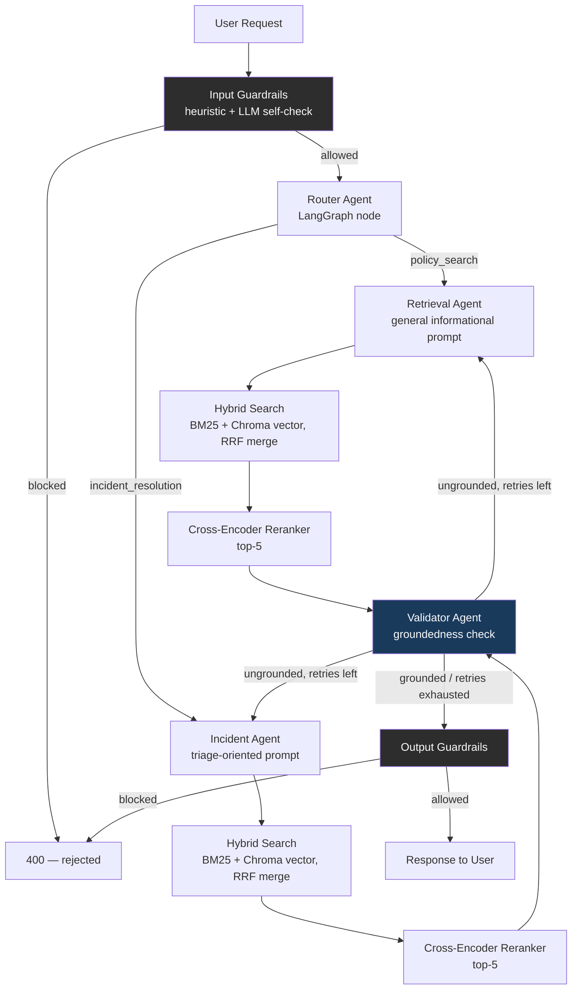

# Architecture

Every node above is wrapped in `@trace_node(...)` (`src/utils/telemetry.py`),
which logs each node's latency to stdout — lightweight and dependency-free,
no separate observability stack required.

A retry loops back to whichever node produced the draft (`retrieval` stays
on `retrieval`, `incident` stays on `incident`), not always the same node —
see `agents/graph.py` for the conditional edge logic.

## Demo

- [ ] Add a Loom/screen-recording link here once recorded (see checklist in README)
